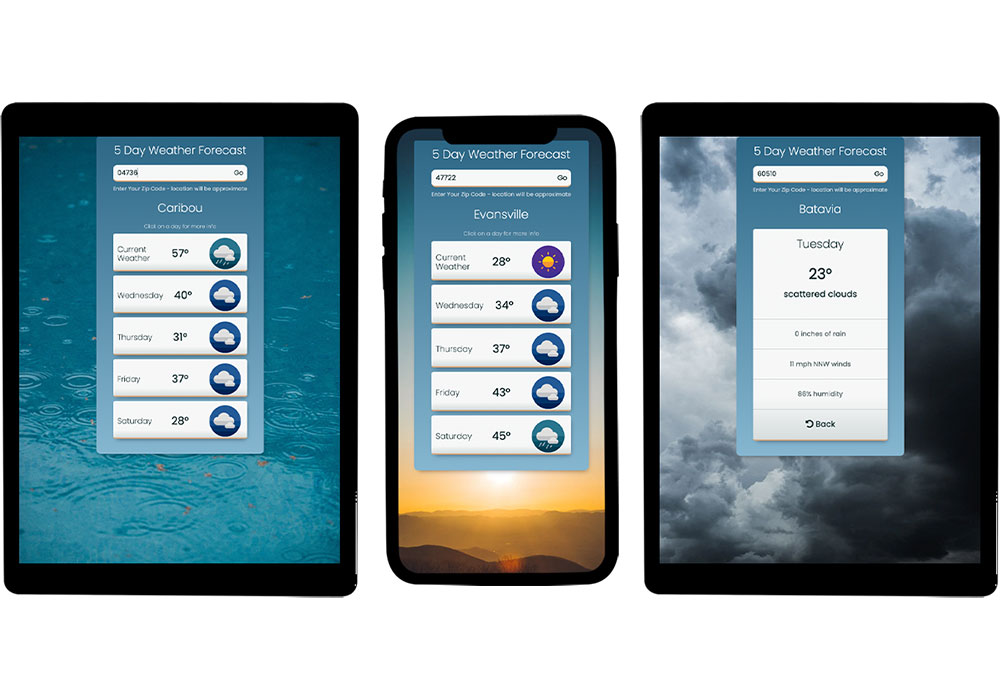

# 5 Day Forecast

Enter you're zip code, and get weather predictions for the next five days

## Table of contents

- [Overview](#overview)
  - [The challenge](#the-challenge)
  - [Screenshot](#screenshot)
  - [Links](#links)
- [My process](#my-process)
  - [Built with](#built-with)
  <!-- - [What I learned](#what-i-learned) -->
  - [Continued development](#continued-development)
  <!-- - [Useful resources](#useful-resources) -->
- [Author](#author)
<!-- - [Acknowledgments](#acknowledgments) -->


## Overview

### The challenge

Users should be able to:

- Enter a zip code into the search field to load weather data for the next five days for that location
- Select one of the days to see more specific weather details

### Screenshot



### Links

- Live Site URL: [https://5-day-forecast.netlify.app/](https://5-day-forecast.netlify.app/)

## My process

### Built with

- Mobile-first workflow
- Semantic HTML5 markup
- CSS Flex and Grid
- [React](https://reactjs.org/) - JS library
- [Axios] (https://axios-http.com/) - HTTP client
- [react-spring] (https://www.react-spring.io/) - Animation library

<!-- ### What I learned

Use this section to recap over some of your major learnings while working through this project. Writing these out and providing code samples of areas you want to highlight is a great way to reinforce your own knowledge.

To see how you can add code snippets, see below:

```html
<h1>Some HTML code I'm proud of</h1>
```
```css
.proud-of-this-css {
  color: papayawhip;
}
```
```js
const proudOfThisFunc = () => {
  console.log('🎉')
}
``` -->


### Continued development

Ways to improve this app include
- Validating search input
- Allowing for search by City name
- Incorporating GPS data

## Author

- [Michael Weber](https://michaelweber.dev/)
- [LinkedIn](https://www.linkedin.com/in/michaelscottweber/)

